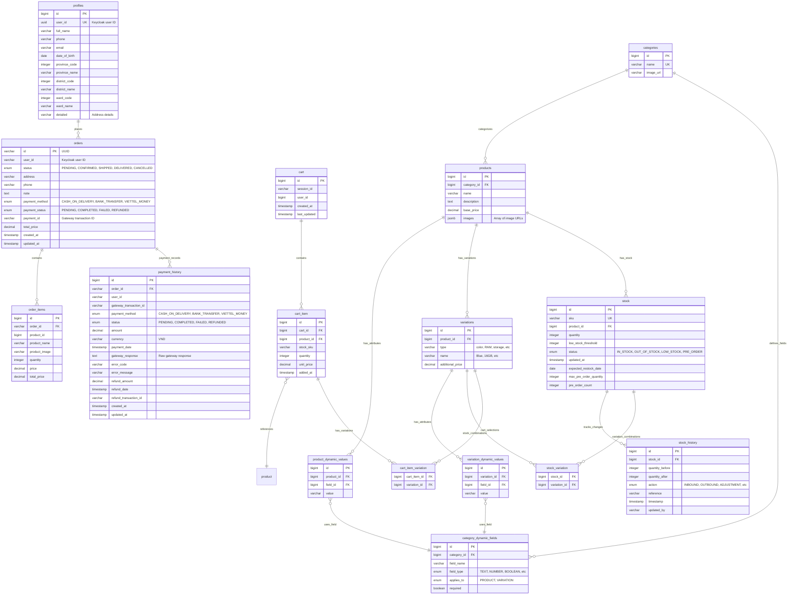

# VDT E-commerce Database ERD

## Key Relationships and Design Notes:

### 1. **Dynamic Product Attributes System**
- Uses `category_dynamic_fields` to define flexible attributes for different product categories
- `product_dynamic_values` and `variation_dynamic_values` store actual values
- Supports both product-level and variation-level attributes

### 2. **Flexible Stock Management**
- Stock entries can be associated with specific product-variation combinations
- Comprehensive stock history tracking for auditing
- Support for pre-orders and low stock alerts

### 3. **User Management Integration**
- Uses Keycloak for authentication (user_id references external system)
- Local profile storage for additional user information

### 4. **Cart and Order Flow**
- Guest carts (session-based) and user carts supported
- Complex variation selection in cart items
- Order items store snapshot of product data at time of purchase

### 5. **Payment Integration**
- Designed for Viettel Money payment gateway integration
- Comprehensive payment history tracking
- Support for refunds and payment status tracking

### 6. **Indexing Strategy**
- Strategic database indexes on frequently queried columns
- Performance optimized for e-commerce workloads

This ERD represents a comprehensive e-commerce system with flexible product catalogs, sophisticated stock management, and integrated payment processing specifically designed for Vietnamese market requirements.
