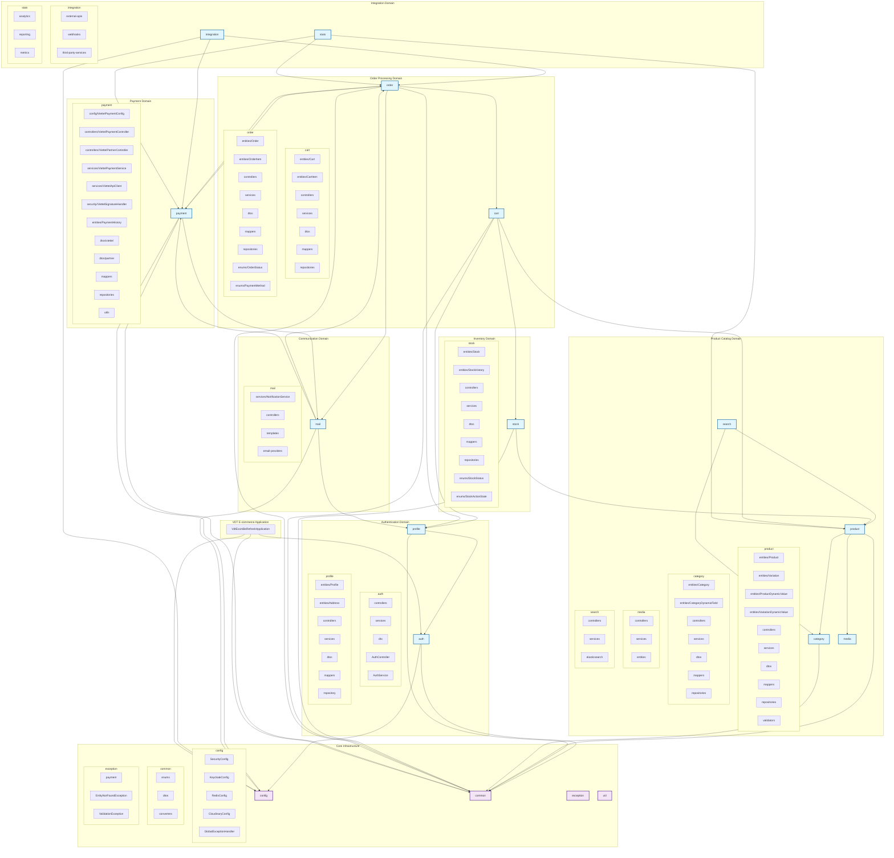

# VDT E-commerce UML Package Diagram

## Package Architecture Overview

### **Core Infrastructure Layer**
- **config**: Cross-cutting configuration classes (Security, Keycloak, Redis, Cloudinary)
- **common**: Shared DTOs, enums, converters used across all domains
- **exception**: Global exception handling and domain-specific exceptions
- **util**: Utility classes and helper functions

### **Domain-Driven Architecture**

#### **1. Authentication Domain**
- **auth**: User authentication, JWT token management, Keycloak integration
- **profile**: User profile management with embedded address information

#### **2. Product Catalog Domain**
- **product**: Core product entities with dynamic attributes and variations
- **category**: Hierarchical product categorization with dynamic field definitions
- **media**: Product image and media asset management
- **search**: Elasticsearch integration for product search and filtering

#### **3. Inventory Domain**
- **stock**: Stock level management with comprehensive history tracking
- Supports pre-orders, low stock alerts, and multi-variation inventory

#### **4. Order Processing Domain**
- **cart**: Shopping cart management with session and user support
- **order**: Complete order lifecycle management with state machine pattern

#### **5. Payment Domain**
- **payment**: Comprehensive Viettel Money payment gateway integration
- Includes API clients, signature handling, webhook processing, and configuration management

#### **6. Communication Domain**
- **mail**: Email notification system with template support
- Handles order confirmations, payment notifications, and system alerts

#### **7. Integration Domain**
- **integration**: External service integrations and webhooks
- **stats**: Analytics, reporting, and metrics collection

### **Key Architectural Patterns**

#### **Layered Architecture**
Each domain follows a consistent layered structure:
- **Controllers**: REST API endpoints
- **Services**: Business logic implementation
- **Repositories**: Data access layer
- **Entities**: JPA domain models
- **DTOs**: Data transfer objects
- **Mappers**: Entity-DTO conversion (MapStruct)

#### **Domain-Driven Design**
- Clear domain boundaries with minimal cross-domain dependencies
- Each domain encapsulates related business logic
- Shared kernel approach for common utilities and configurations

#### **Dependency Flow**
- **Core Infrastructure** ← All Domains
- **Product Catalog** ← **Inventory**, **Order Processing**
- **Authentication** ← **Order Processing**, **Communication**
- **Payment** ↔ **Order Processing** (bidirectional)
- **Communication** ← Multiple domains for notifications

#### **Viettel Payment Integration Architecture**
The payment domain demonstrates sophisticated integration patterns:
- **Config Pattern**: Environment-specific configuration management
- **Gateway Pattern**: ViettelApiClient for external API abstraction
- **Facade Pattern**: ViettelPaymentService for simplified payment operations
- **Security Handler**: Dedicated signature verification and generation
- **Dual Controllers**: Separate controllers for frontend and partner callbacks

This architecture supports the Vietnamese e-commerce market requirements with robust payment processing, flexible product catalogs, and comprehensive order management while maintaining clean separation of concerns and scalability.
